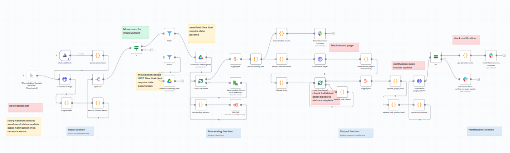

   

# 🧠 Client Data Onboarding Automation — Case Study

Purpose-built n8n workflow that eliminates manual analyst effort when seeding client datasets into the Visual-alpha platform.

This repository hosts the workflow configuration, scripts, and documentation for an end-to-end client data onboarding automation built on n8n. It showcases how chat-triggered automations can replace manual data seeding across Slack, Confluence, and Google Drive.

**TL;DR**
- Live n8n-driven automation slashes the client data seeding cycle from hours to minutes.
- Slack, Confluence, and Visual-alpha services stay in sync with zero manual handoffs.
- Designed, built, and supported end-to-end by Samuel Kyere.

**Project Snapshot**
- 85% reduction in analyst time from request to production-ready data.
- 100% automated Confluence status updates with auditable run logs.
- Owner: Samuel Kyere, automation specialist for data operations and API integrations.
- Status: Live in production, servicing historical data backfills and new onboardings.

## My Role & Responsibilities
- Scoped business requirements with data operations leadership and mapped current-state process.
- Architected the Slack-to-n8n-to-Visual-alpha integration and configured supporting infrastructure.
- Developed Python data processors and Node.js payload wrapper, including validation logic.
- Implemented monitoring, logging, and Confluence status automation to meet audit expectations.

## Challenge
- Manual seeding required editing shell commands, uploading files, and hand-maintaining Confluence checklists.
- Missed updates on Confluence left stakeholders guessing about run status and next steps.
- Slack feedback loops were slow; analysts discovered issues hours after failures occurred.

## Objectives
- Compress end-to-end seeding time by at least 80% while eliminating command errors.
- Provide real-time visibility for data operations leads via Slack and Confluence.
- Introduce traceable logging to accelerate investigation and meet audit expectations.

## Solution Overview
- Orchestrated n8n workflow triggered by Slack slash command or schedule.
- Python processors normalize and validate client spreadsheets before ingestion.
- Node.js wrapper delivers clean payloads into Visual-alpha data services.
- Automated Confluence updates and Slack notifications keep every stakeholder aligned.

## Reliability & Governance
- Credentials stored within n8n credential vault; access scoped per integration.
- Webhook routing secured through Cloudflare Worker with IP allow-listing and secret validation.
- Error logs stored locally with restricted permissions; structured JSON output supports audits.
- Rollback playbook documents manual recovery path in case of downstream service outage.

## Results & Impact
- 85% analyst effort reduction compared with the previous manual approach.
- Zero missed Confluence status updates since launch; every run writes to the checklist.
- Faster incident response: Slack alerts deliver success, warning, or failure context instantly.
- Local error logs shorten root-cause analysis and establish a compliance-ready audit trail.

## Architecture Overview


```
Slack Slash Command → Cloudflare Worker → Localtunnel → n8n Workflow
					   ↓
				 Python + Node.js Scripts
					   ↓
			 Visual-alpha Data Services + Confluence API
					   ↓
				   Slack & Local Logs
```

## Demo & Visual Assets
- Walkthrough video (coming soon) demonstrating Slack trigger through Visual-alpha ingestion.
- Annotated n8n workflow diagram outlining node responsibilities and data touchpoints.
- Before-and-after metrics chart visualizing the 85% efficiency gain.
- Short demo GIF (coming soon) highlighting Confluence updates and Slack notifications.

## Repository Contents
- `/workflow/` – exported n8n workflow JSON
- `/scripts/python/` – data normalization scripts
- `/scripts/node/` – payload wrapper
- `/docs/` – configuration and setup notes
- `/logs/` – sample output (sanitized)

## Quick Start
1. Clone the repository.
2. Import `workflow/workflow.json` into your n8n instance.
3. Configure credentials for Slack, Confluence, and Google Drive.
4. Trigger the `/seed-client` Slack command to start the workflow.
5. Monitor the Slack channel, Confluence checklist, and local logs for results.

## Automation Flow
1. Operator triggers the Slack slash command or schedules the n8n workflow.
2. Cloudflare Worker routes the request through localtunnel to the on-prem n8n instance.
3. n8n retrieves client files from Google Drive and hands them to Python scripts for normalization.
4. Node.js wrapper publishes the cleaned dataset into Visual-alpha data services.
5. Confluence API updates the checklist page and posts run context to the shared space.
6. Slack sends success or exception notifications; detailed logs persist locally under `/logs/errors`.

## Implementation Highlights
- n8n orchestrates the workflow, providing retries, scheduling, and credential management.
- Slack API slash command offers controlled, auditable triggers for analysts and managers.
- Confluence API automation ensures operational documentation stays synchronized with real-time status.
- Cloudflare Worker and localtunnel secure webhook delivery during development and testing phases.
- Python scripts handle spreadsheet idiosyncrasies and validation, removing manual spreadsheet work.
- Node.js wrapper manages final payload formatting and integration with Visual-alpha services.
- Local filesystem logging captures stack traces and payload metadata for audit readiness.

## 🧰 Tech Stack
**n8n**, **Python**, **Node.js**, **Slack API**, **Confluence API**, **Google Drive API**, **Cloudflare Workers**

## Operational Excellence
- Schedule via n8n cron or trigger with `/seed-client` Slack command to fit run cadence.
- Monitor Slack channel for real-time updates; failure posts include error codes and log locations.
- Review Confluence page after each run to confirm automated checklist completion.
- Conduct post-run checks in `/logs/errors` to document incidents and continuous improvements.

## Setup & Configuration
1. Import the workflow JSON into your n8n instance.
2. Configure credentials for Slack, Confluence, Google Drive, and Visual-alpha services.
3. Confirm `/logs/errors` exists and is writable by the automation user.
4. Deploy Cloudflare Worker snippet and localtunnel process to expose the development webhook securely.
5. Execute a dry run with sample datasets to validate transformations, notifications, and downstream callbacks.

## Roadmap
- Move error logs to a shared network location for multi-user access and backup.
- Harden the Slack trigger flow to meet production uptime requirements.
- Package the workflow for managed n8n cloud deployment with centralized secrets handling.

## 🤝 Work With Samuel
I’m open to collaborations and consulting on data automation, API integrations, and chat-based workflow systems. Find me on LinkedIn or email (contact info in profile).

## 🔗 Related Projects
- **Automated Social Media Manager** — AI-powered post creation and scheduling (coming soon)
- **RAG / FAQ Voice Bot** — AI assistant for internal knowledge access (coming soon)

## 🧭 Key Takeaway
This project demonstrates how chat-triggered automations and modular workflows can eliminate repetitive data operations while improving visibility, auditability, and speed. It is a foundation for broader work in **chatbot-driven workflow automation** and intelligent data pipelines.